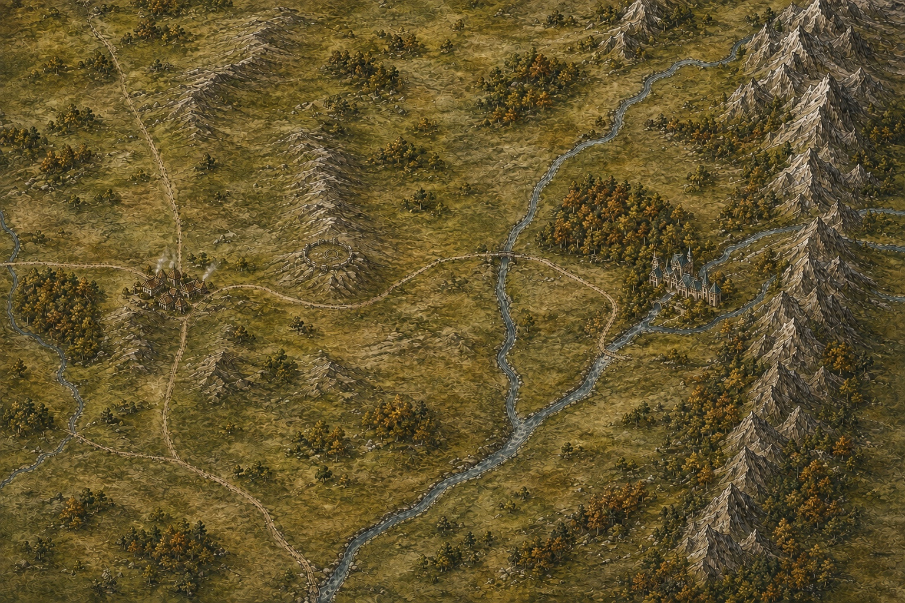

# Middle-earth — A Living Atlas

An interactive, painterly atlas of Middle-earth, from the Grey Havens and the Shire through Rohan to Gondor and Mordor. Explore Minas Tirith, the Morgul Vale, Erech and Lamedon, and the western coast through Drúwaith Iaur to Anfalas, with flowing rivers and a shared day and night cycle.



## Explore the atlas

- Pan and zoom across a continuous illustrated landscape, with regional views spanning Eriador, Rohan, Gondor, Ithilien and Mordor.
- Discover landmarks including Rivendell, Moria, Lórien, Edoras, Minas Tirith, Minas Morgul, Erech and Calembel, with book-based reference notes.
- Watch a continuous morning, day, evening and night cycle, with changing light, settlement windows, chimney smoke, mist, birds and moving water.
- Adjust the cycle speed, hold a time of day, or pause motion.
- Visit an illustrated study of the Prancing Pony in Bree, sharing the map's clock and atmosphere.
- Navigate with a mouse, touch gestures or the keyboard. Arrow keys pan; plus and minus zoom.

**[Explore the live atlas](https://smikhaylyuk.github.io/middle-earth-atlas/)** — no sign-in required.

## Run locally

Requires Node.js **22.13.0 or newer** and npm.

```sh
npm ci
npm run dev
```

Open the local URL printed by the development server, normally `http://localhost:3000`.

```sh
npm test           # Rendering and navigation regression checks
npm run lint       # Lint the source
npx tsc --noEmit   # Check TypeScript
npm run build     # Create the production build
npm start         # Preview the built Cloudflare Worker locally
```

The application uses React, TypeScript, Vinext, Vite and Tailwind CSS, with Cloudflare Workers build output. The current application needs no database or application API keys. The GitHub Actions workflow builds and publishes the static atlas to GitHub Pages whenever `main` changes. The original Worker deployment remains available through `npm run build`.

## GitHub Pages

`npm run build:pages` exports the complete website to `dist/client`, including the paintings and animations. The build adds the repository prefix to asset URLs so they work at `/middle-earth-atlas/`. Only this public output directory is deployed.

The workflow in `.github/workflows/pages.yml` installs the locked dependencies, checks the source, builds the static site and deploys it using GitHub Pages. The repository uses **Settings → Pages → Source: GitHub Actions**. No personal access token or application secret is required by the workflow.

## Project layout

| Path | Purpose |
| --- | --- |
| `components/living-atlas.tsx` | Map navigation, place details and controls |
| `components/atlas-painting.tsx` | Cached painting and shared canvas renderer |
| `components/use-day-cycle.ts` | Shared animated clock |
| `components/bree-discovery.tsx` | Prancing Pony detail scene |
| `lib/atlas/places.ts` | Place descriptions and references |
| `lib/atlas/world.ts` | World dimensions and place coordinates |
| `lib/atlas/illustration.ts` | Eastern artwork anchors |
| `lib/atlas/western-illustration.ts` | Western artwork anchors |
| `lib/atlas/southern-illustration.ts` | Southern artwork and atmosphere anchors |
| `lib/atlas/anduin-illustration.ts` | Anduin, Lórien and Mirkwood artwork anchors |
| `lib/atlas/rohan-illustration.ts` | Rohan, the White Mountains and Argonath anchors |
| `lib/atlas/webmcp.ts` | Optional structured controls for compatible browser agents |
| `public/images/` | Map paintings, detail art and sprites |
| `docs/lore-and-cartography.md` | Geographic sources, alignment notes and artistic limits |

## Geography and artwork

The geographic reference is Christopher Tolkien's *The West of Middle-earth at the End of the Third Age*. Place notes refer to *The Lord of the Rings* and linked Tolkien Gateway references. See the [cartography notes](docs/lore-and-cartography.md) for sources and implementation details.

The paintings use AI-generated artwork with manually aligned landmarks and effects. Major geographic relationships guide the composition; distances, local river bends, buildings and terrain remain pictorial interpretations. The highlighted road is geographic guidance rather than Frodo's exact itinerary. The day cycle changes the atmosphere, not the story's dates.

This is an unofficial fan project. Middle-earth and its stories were created by J. R. R. Tolkien. The atlas is not affiliated with or endorsed by the Tolkien Estate or other rights holders.

## Map rendering

The approved paintings are precomposed into `public/images/atlas-anfalas.webp`. A canvas draws this image into a viewport-sized backing surface, capped at two device pixels per CSS pixel and approximately eight million pixels. Zoom changes the sampled view, never the canvas allocation. Place markers and effects share the same animation-frame camera update. The clock and effect animations briefly hold during navigation, then resume without skipping time.

To update a painting or its alignment, run `npm run build:atlas` and commit the regenerated paintings and masks in `public/images/atlas-masks/`. The script uses Sharp, already supplied by Vinext, to bake the existing artwork and geographic correction patches. It does not create new terrain. The source paintings remain available for subsequent map expansions.
